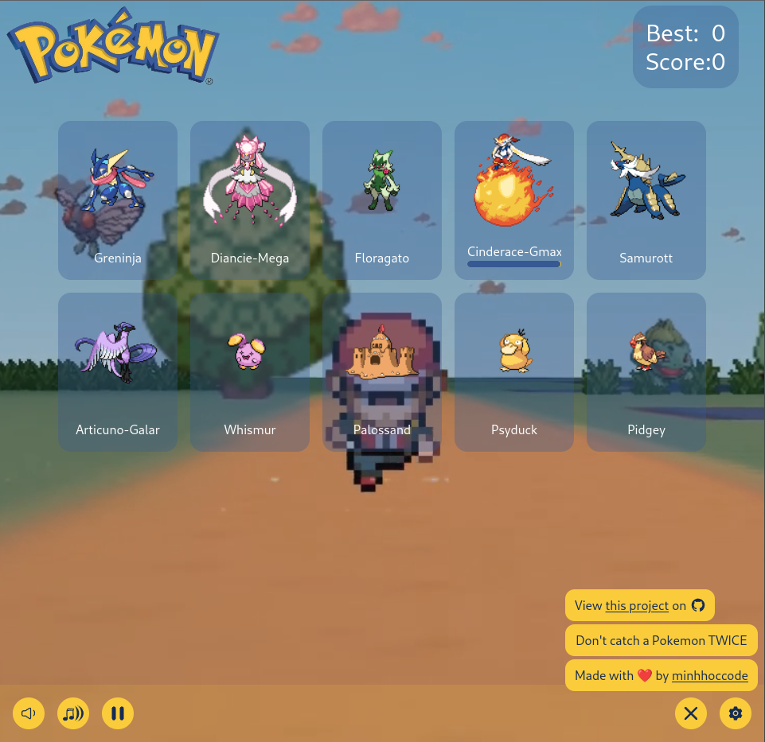

# Unique Pokemon (Memory card)

The **Unique Pokemon** project is created according to the assignment from **The Odin Project** [lesson](https://www.theodinproject.com/lessons/node-path-react-new-memory-card).
<br>
<br>



### 🔗 **Live preview** of the project is [here](https://unique-pokemon.netlify.app/).

## **Features**

- Different Pokemon every time load (more than 1000)
- Loading page
- Difficulty level
- Eye-pleasing animation and UI 😄

## **Outcome**

- Used **React**
- Used **Tailwindcss**
- Used **Bun**
- Used **Vite**
- Used **Netlify**
- Used **react-parallax-tilt** for 3D card
- Used **animista** for beautiful animations
- Learned `usaState`
- Learned `useEffect`
- Learned working with API of Giphy and Pokemon API
- Realize that `async` and `await` function `return` a `new Promise` and not actually the data
- Learned to use `async` and `await` with `reduce`

```jsx
const data = arr.reduce(async (total, current)=>{
	// total will be array of promises because it is returned from async function
	const totalResolved = await total;
},Promise.resolve(...)); // init value of total
```

- Learned to scroll a slider element on `wheel` event on the x-axis (instead of y-axis)
- Learn `shuffle` algorithms
- Working with `audio` and `video`
- Learned to style scroll bar in CSS

## **Getting Started**

```
HTTPS - git clone https://github.com/minhhoccode111/memory-card-top.git

SSH - git clone git@github.com:minhhoccode111/memory-card-top.git

cd memory-card

npm install

npm start
```

## **Idea to implement**

- Flip cards animation

## **Navigation**

- See my previous project [CV Application](https://cv-application-top.netlify.app/)
- See all my projects' live demos [This link](https://github.com/minhhoccode111/all-projects-live-demos)
